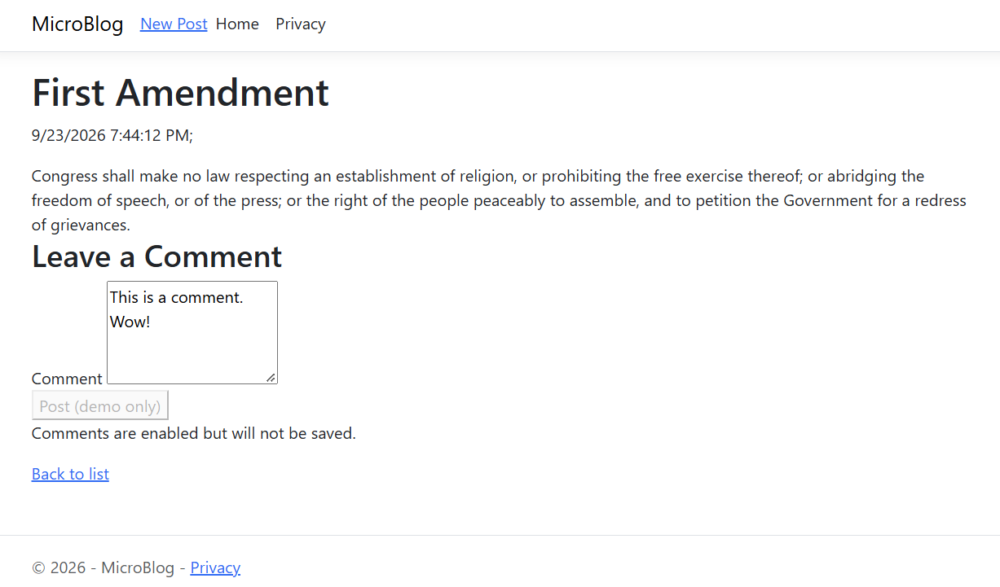
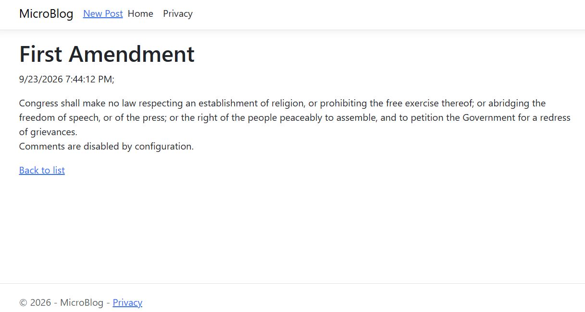

Modification of MicroBlog, forking from "Repositories & Dependency Injection".
In addition to the functionality of that version, this version implements basic comment posting structure (minus functionality).

To enable comments, appsettings.Development.json should have the `EnableComments` flag set to true.
To disable comments, set this to false.

Viewing a post with comments enabled:

Viewing a post with comments disabled:
