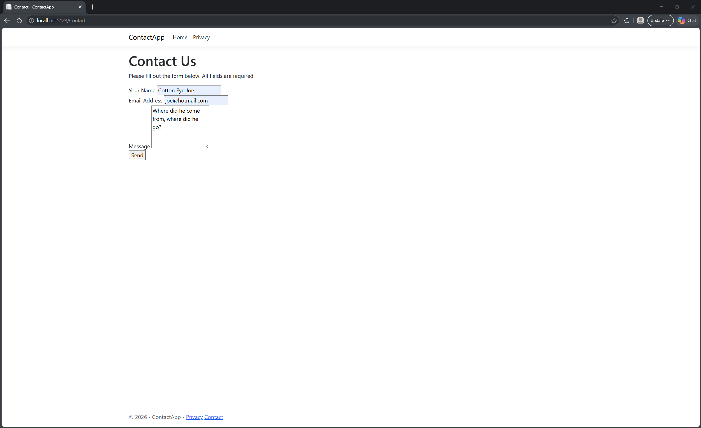
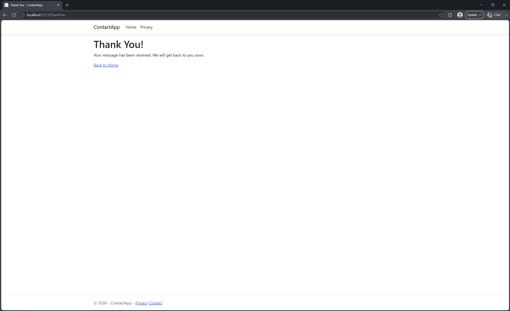

# Contact App
Basic Web App running off of ASP.NET

If running this off localhost, you can use the URL `http://localhost:`[port] to access this page.
The Contact page can then be accessed through either the bottom navigation or by appending `/Contact` to the URL.

Screenshots:

