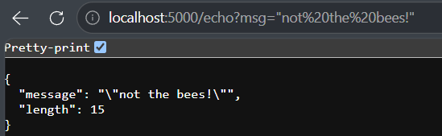

# Journal API
Basic API running off of ASP.NET

If running this from localhost, you can use the format `curl http://localhost:`[port] to access its commands.

Commands are run by appending their syntax to the end of the curl command.
## Command Endpoints:
An empty command will print `Hello ASP.NET!` to the command line.
- `/time`
	- Returns `{"utc":"`(timestamp)`"}`
- `/echo?msg=`[message]
	- Returns `{"message":"`(provided message)`","length":`(string length)`}` if provided a non-empty non-whitespace string
	- Otherwise returns	`{"error":"Query parameter 'msg' is required."}`

Example:

